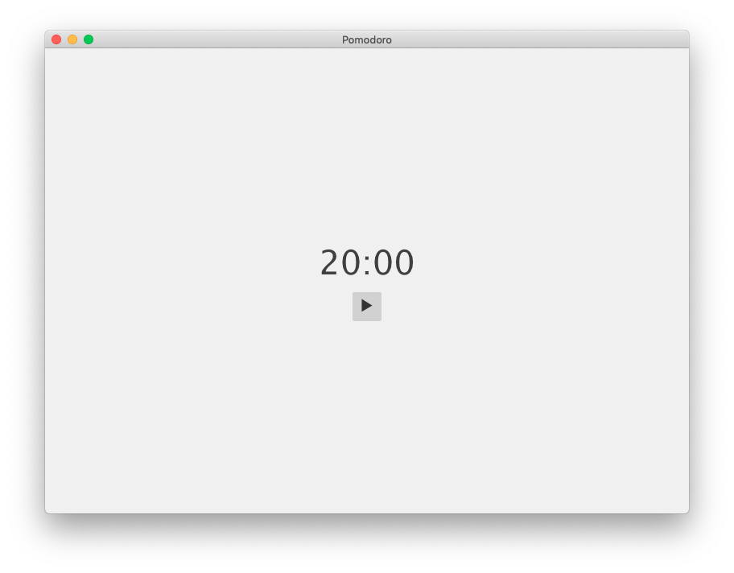

# Pomodoro

## Setup

Run `npm install`.

To run the application, run `npm run start`.

To build and deploy the application, run `npm run build`.  This will create the directory `dist/`.

## Screen shot

## Sources

Source: derived from <https://github.com/electron/electron-quick-start>